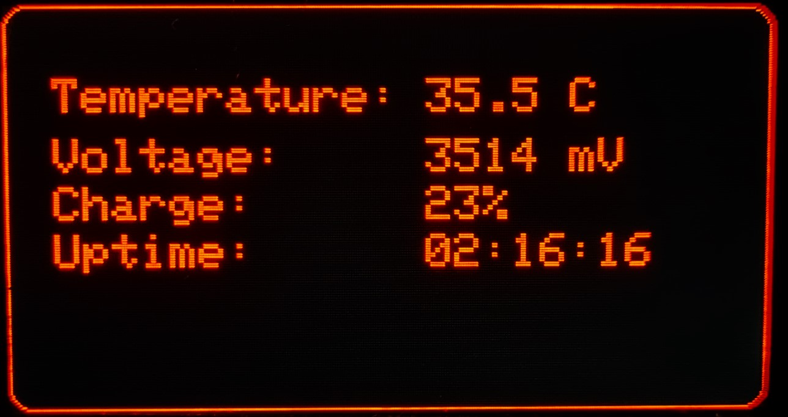
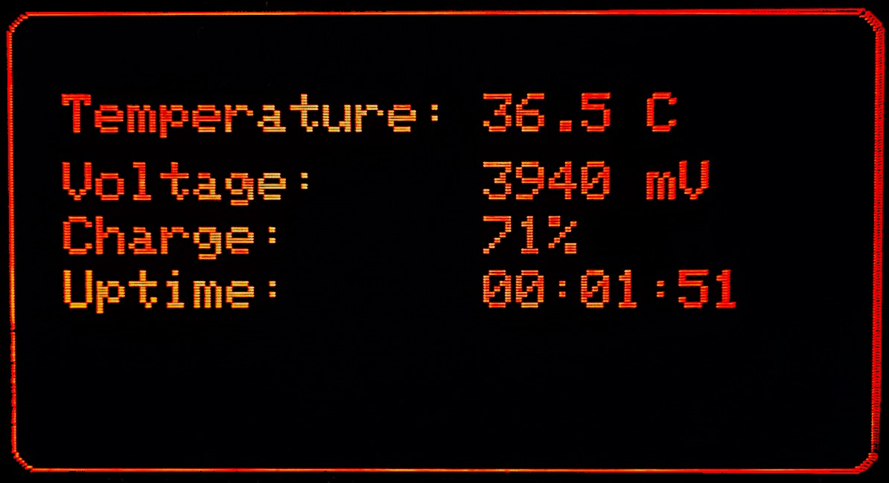

# T-Display-S3 Internal Temperature and Battery Monitor

This is a simple temperature and battery monitor for the T-Display-S3.
It uses the ESP32 internal temperature sensor and the onboard battery voltage divider to display the temperature battery voltage and percentage on the screen.

## Display Examples

## Installation

You can compile it in PlatformIO or use the [Flash Download Tool](https://docs.espressif.com/projects/esp-test-tools/en/latest/esp32/production_stage/tools/flash_download_tool.html) to flash it to your device

